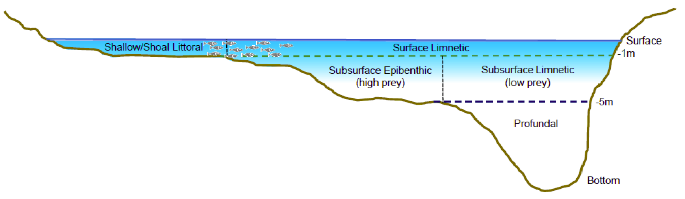

## Characterizing Physical Habitat For Salmonid Residents

The quality of physical habitat for juvenile salmonids is defined according to
specifications outlined by the Water Quality Parameter and Habitat Productivity
Technical Group. Habitat quality is assessed in terms of temperature, salinity
and dissolved oxygen thresholds, with four categories defined for each variable.

#### Temperature:

| optimal growth        | positive growth                               | no/negative growth     | unsuitable           |
|:----------------------|:----------------------------------------------|:-----------------------|:---------------------|
| $14-18^\circ\text{C}$ | $< 14^\circ\text{C}$ or $18-21^\circ\text{C}$ | $21--25^\circ\text{C}$ | $> 25^\circ\text{C}$ |

#### Dissolved Oxygen:

| minimal impairment          | some impairment    | severe impairment         | unsuitable         |
|:----------------------------|:-------------------|:--------------------------|:-------------------|
| $> 6 \text{ mg/L}$          | $4-6 \text{ mg/L}$ | $3-4 \text{ mg/L}$        | $< 3 \text{ mg/L}$ |

#### Salinity:

| freshwater           | isotonic                   | brackish                                       | marine                                          |
|:---------------------|:---------------------------|:-----------------------------------------------|:------------------------------------------------|
| $< 10 \text{ ppt}$   | $10-15 \text{ ppt}$        | $15-28 \text{ ppt}$                            | $> 28 \text{ ppt}$                              |
| *Low energy demand*  | *negligible energy demand* | *high energy demand (freshwater-acclimated)*   | *unsuitable (freshwater acclimated)*            |
|                      |                            | *low energy demand (saltwater-aclimated)*      | *moderate energy demand (saltwater-aclimated)*  |

## Overall Habitat

To assess the overall habitat quality of a region, the individual ratings are 
into the 9 categories defined below.

| category                                   | Description                                                                                                |
|:-------------------------------------------|:-----------------------------------------------------------------------------------------------------------|
| Optimal                                    | optimal or positive growth (T); minimal impairment (DO); Low or negligible energy demand (S)               |
| Growth limited                             | **no/negative growth (T)**;  minimal impairment (DO); Low or negligible energy demand (S)                  |
| Impaired                                   | optimal or positive growth (T); **some or severe impairment (DO)**; Low or negligible energy demand (S)    |
| Energy demanding                           | optimal or positive growth (T); minimal impairment (DO); **moderate or high energy demand (S)**            |
| Growth limited, impaired                   | **no/negative growth (T)**; **some or severe impairment (DO)**; Low or negligible energy demand (S)        |
| Growth limited, energy demanding           | **no/negative growth (T)**; minimal impairment (DO); **moderate or high energy demand (S)**                |
| impaired, energy demanding                 | optimal or positive growth (T); **some or severe impairment (DO)**; **moderate or high energy demand (S)** |
| Growth limited, impaired, energy demanding | **no/negative growth (T)**; **some or severe impairment (DO)**; **moderate or high energy demand (S)**     |
| Unsuitable                                 | any one of: **unsuitable (T)**; **unsuitable (S)**; **unsuitable (DO)**                                    |

## Depth Zone Definitions

Habitat quality can also be assessed based on water depth, which has
important implications for foraging, shelter and predation risk. The Water 
Quality Parameter and Habitat Productivity Technical Group has defined a 
separate set of habitat categories that assess habitat in terms of water depth.

| Category                  | Description                                                                       | Criteria                                                         |
|:--------------------------|:----------------------------------------------------------------------------------|:-----------------------------------------------------------------|
| Littoral (Shallow/shoal)  | High prey availability, high avian predation risk, low aquatic predation risk     | $depth < 1\text{m}$ and $\max{(depth)} < 1\text{m}$              |
| Surface Limnetic          | Low prey availability, high avian predation risk, high aquatic predation risk     | $depth < 1\text{m}$ and $\max{(depth)} \geq 1\text{m}$           |
| Epibenthic                | High prey availability, low avian predation risk, moderate aquatic predation risk | $1\text{m} \leq depth \leq 5\text{m}$ and $\max{(depth)} \leq 5$ |
| Subsurface Limnetic       | Low prey availability, low avian predation risk, moderate aquatic predation risk  | $1\text{m} \leq depth \leq 5\text{m}$ and $\max{(depth)} > 5$    |
| Profundal                 | Low prey availability, no predation risk                                          | $depth > 5\text{m}$                                              |
