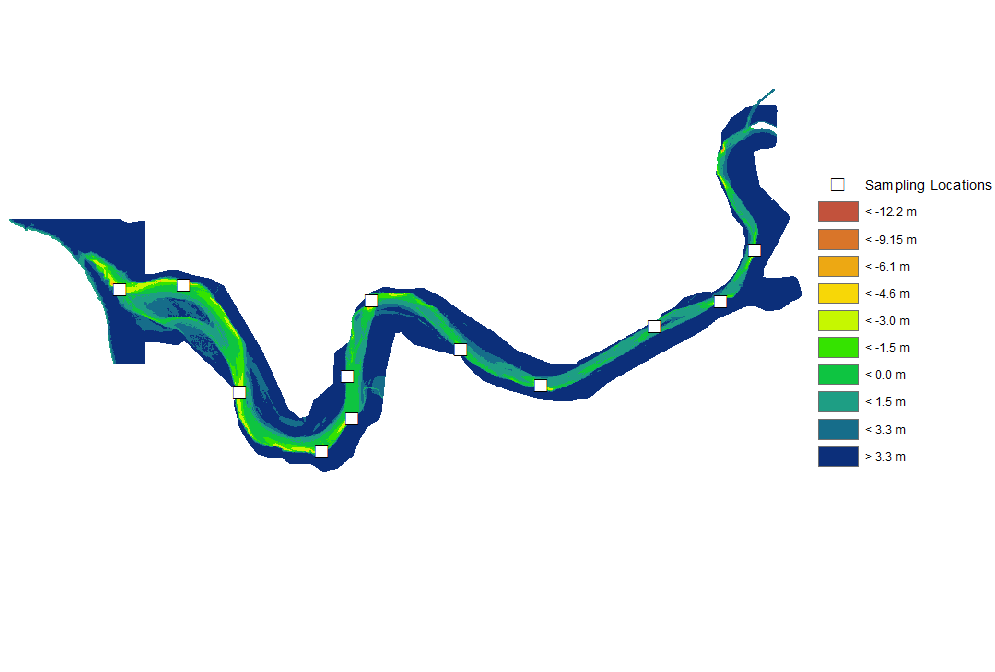
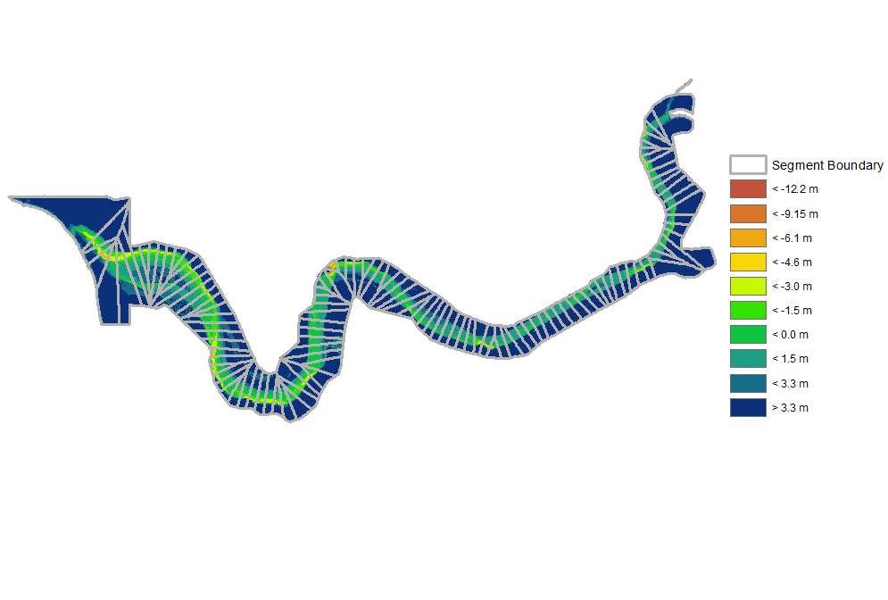
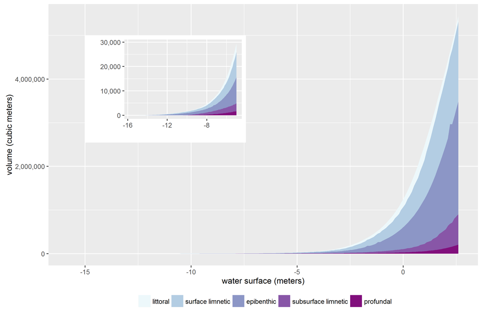

## Technical Details

All data is processed using the 
[`rremat` package](https://www.github.com/mkoohafkan/rremat) developed by the 
author. Please review the package documentation for specific information on 
processing algorithms.

### Interpolating Water Quality Data

Water quality data is available for 12 key locations in the estuary. These 
locations were periodically sampled using a CTD profiler, which provides 
high-resolution vertical profiles of key water quality parameters. This data 
constitutes a data transect that can be interpolated to produce the water 
quality grids. Interpolation was performed using the Natural Neighbor 
Interpolation algorithm provided by Matlab and the grids were referenced to 
the segment delineations by assigning the segment identifier to each sampling 
location.

### Computing Estuary Volume

Estuary volume computations are derived from the 2009 bathymetry raster and a 
manual delineation of of the estuary thalweg using ArcMap. The thalweg was 
traced by manually tweaking the raster symbology to visually accentuate the 
high bank lines and the river thalweg; the thalweg was then traced visually by 
manually placing a series of points using the editor toolbar. This irregular 
point series was converted to a polyline representing the thalweg, after which 
the Construct Points tool was used to place equally-spaced points along the 
polyline with an interval of 100 meters. The polyline endpoint closest to the 
estuary mouth was defined as river distance 0, while the upstream-most endpoint
of the polyline was assigned a river distance of 12200, i.e. 12.2 km upstream 
of the estuary mouth. This series of points was then used as input to the 
Euclidian Distance Allocation tool to assign each cell in the bathymetry raster 
the distance associated with the nearest point along the thalweg; in this way,
the estuary was subdivided into 122 segments as shown below.

 

To speed up estuary volume calculations, the bathymetry raster was preprocessed
by first rounding each raster cell value to the nearest 0.1 meters, and then 
counting the number of cells of each unique elevation in each segment to 
convert the raster to a flat table. Estuary volume was computed in 0.1-meter 
depth slices for water surface elevations ranging from -15.8 meters to +2.6 
meters NGVD29 by counting the number of cells inundated in each
segment for each depth interval and each water surface interval; furthermore, 
the number of inundated cells in each segment were subdivided according the 
foraging habitat categories described by the Water Quality Parameter and Habitat 
Productivity Technical Group. These counts were then multiplied by the 
bathymetry raster resolution to obtain water volumes. The stage-volume curve of 
the estuary for all foraging habitat categories are shown below.

